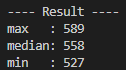
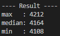

# push_swap
Sort integers using 2 stacks (a & b) in minimum operations with the least number of moves possible.

### [push swap visualizer](https://github.com/o-reo/push_swap_visualizer)  
 Copyright (C) 2007 Free Software Foundation, Inc. / [LICENSE](https://github.com/o-reo/push_swap_visualizer/blob/master/LICENSE)


<br>

## Score
### [push swap tester](https://github.com/nafuka11/push_swap_tester) 

Copyright (c) 2021 nafuka11 / [LICENSE](https://github.com/nafuka11/push_swap_tester/blob/master/LICENSE)
```shell
$ python3 push_swap_tester.py -l 100 -c 500
```


```shell
$ python3 push_swap_tester.py -l 500 -c 500
```


<br>

---
### Usage
```shell
# push_swap
$ make
$ ./push_swap 2 -5 10 7

# checker
$ make bonus
$ ARG="2 -5 10 7"; ./push_swap $ARG | ./checker $ARG
```

<br>

operations
- sa : swap a
- sb : swap b
- ss : swap a & swap b
- pa : push a
- pb : push b
- ra : rotate a
- rb : rotate b
- rr : rotate a & rotate b
- rra : reverse rotate a
- rrb : reverse rotate b
- rrr : reverse rotate a & reverse rotate b

<br>

External functions
- read, write
- malloc, free